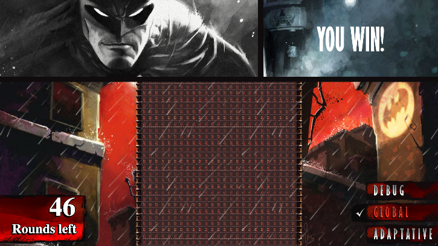
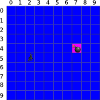
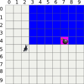
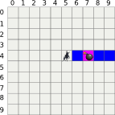
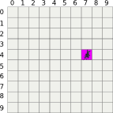

# Shadows of the Knight - Episode 1

## The Goal

You will look for the hostages on a given building by jumping from one window to another using your grapnel gun. Your goal is to jump to the window where the hostages are located in order to disarm the bombs. Unfortunately, you have a limited number of jumps before the bombs go off...


  
## Rules

Before each jump, the heat-signature device will provide you with the direction of the bombs based on your current position:

```shell
U (Up)
UR (Up-Right)
R (Right)
DR (Down-Right)
D (Down)
DL (Down-Left)
L (Left)
UL (Up-Left)
```

Your mission is to program the device so that it indicates the location of the next window you should jump to in order to reach the bombs' room as soon as possible.

Buildings are represented as a rectangular array of windows, the window in the top left corner of the building is at index (0,0).
  
## Note

For some tests, the bombs' location may change from one execution to the other: the goal is to help you find the best algorithm in all cases.

The tests provided are similar to the validation tests used to compute the final score but remain different.

### Game Input

The program must first read the initialization data from standard input. Then, within an infinite loop, read the device data from the standard input and provide to the standard output the next movement instruction.

**Initialization input :**

* **Line 1 :** 2 integers W H. The (W, H) couple represents the width and height of the building as a number of windows.

* **Line 2 :** 1 integer N, which represents the number of jumps you can make before the bombs go off.

* **Line 3 :** 2 integers X0 Y0, representing your starting position.

**Input for one game turn :**

* The direction indicating where the bomb is.

**Output for one game turn :**

* A single line with 2 integers X Y separated by a space character. (X, Y) represents the location of the next window you should jump to. X represents the index along the horizontal axis, Y represents the index along the vertical axis. (0,0) is located in the top-left corner of the building.

**Constraints :**

```shell
1 ≤ W ≤ 10000
1 ≤ H ≤ 10000
2 ≤ N ≤ 100
0 ≤ X, X0 < W
0 ≤ Y, Y0 < H
Response time per turn ≤ 150ms
Response time per turn ≤ 150ms
```

*Example :*

**Initialization input :**

```shell
10 10     Building has 100 windows (10x10)
6         You have 6 jumps to find the bombs
2 5       You start at position (2,5)
```



**No output expected**

**Input for turn 1 :**

```shell
UR
```

*Hostages are in the upward-right direction*


**Output for turn 1 :**

```shell
5 4
```

*You jump to window (5,4)*

**Input for turn 2 :**

```shell
R
```

*Hostages are located to your right*


**Output for turn 2 :**

```shell
7 4
```

*You jump to window (7,4)*



You found the hostages. You can defuse the bombs in time. You win!
